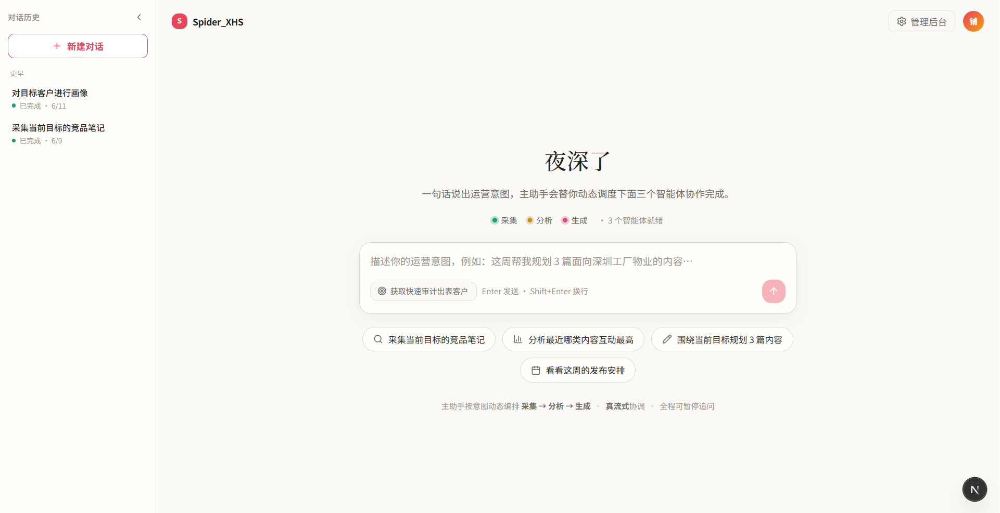
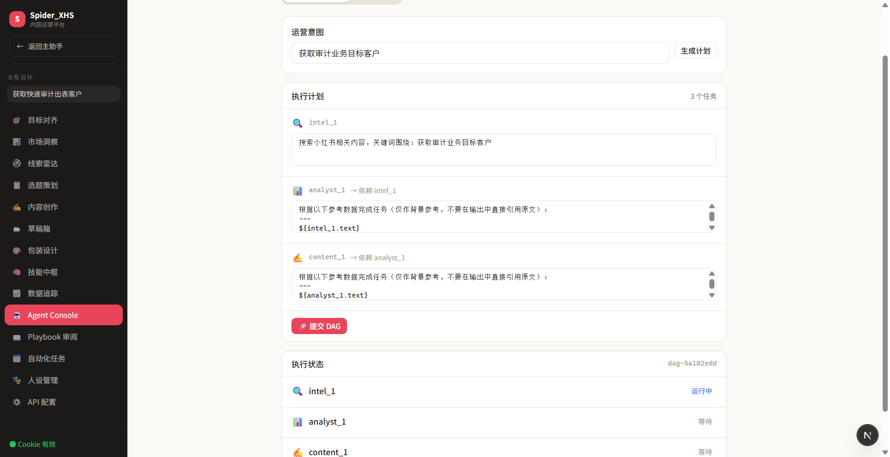
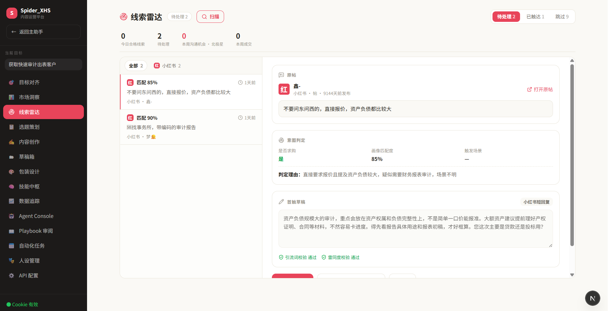

<div align="center">

[中文](README.md) | English

# XHS AI Ops · An Agent Harness for Content Operations

**A from-scratch Agent Harness, built to solve a real business pain — wrapping an LLM into a product that keeps helping people in messy, real-world scenarios.**


</div>

---

## In one line

I run a small local business. To kill my own daily pain — manually scrolling Xiaohongshu (RED) for leads, picking topics by hand, publishing post by post — I built this system from zero: a **data layer** that wraps the platform's read/write, a **middle layer** where multiple agents collaborate on intel-gathering / content-generation / analytics, and a **chat-first frontend** that folds the whole orchestration into a single natural-language prompt.

At its core it is an **Agent Harness** — everything *besides the model* that makes an agent actually usable, trustworthy and observable in the real world: Agent Loop, Tool Use, Multi-Agent collaboration, Context Engineering, Memory, Skills, and graceful failure handling. This project is my first-hand practice of **"Model + Harness = Agent."**

> The value isn't "it runs." It's: **taking a vague real need, decomposing it into an orchestratable, governable, observable product system, and owning every abnormal branch, edge case and failure path.**

---

## The real problem it answers

Not "build an agent toy," but a product question: **how do you make an agent keep helping people, more deeply, across more scenarios — in a real, long-running, failure-prone setting?**

- **Real tasks, not demos.** It runs the actual jobs in my own business — finding leads, choosing topics, writing content, reviewing results. Every agent is judged by one thing: did it save me time / bring leads this week?
- **A nose for failure modes.** Platform rate-limiting, expired cookies, empty LLM responses, *shadow throttling* (success response but empty data), duplicate tool triggers — each abnormal branch is detected and handled, not just the happy path.
- **Data-driven iteration.** Content performance is quantified with a weighted CES model, lead quality with an intent-match score, and the collect → qualify → convert funnel is made observable — so "did the product get better" is measurable, not a gut feeling.

---

## Core: it's an Agent Harness

Described in this team's own vocabulary (each item: *what I built + the hard part*):

- **Multi-Agent / Subagent** — `HermesMaster` is the orchestrator and security gateway: sub-agents must be instantiated through it (token-checked to prevent unauthorized direct calls), tools are whitelisted per role via `ToolPolicy`, every stage is audited. *Hard part: agents collaborating without going off the rails.*
- **Agent Loop + Planning** — the main loop is GOAP-based (goal-oriented action planning) with a scratch_pad; complex intents are decomposed into a DAG before execution. *Hard part: giving the agent a "plan first, then act" structure.*
- **Context Engineering** — when context overflows, a state-aware compressor kicks in, with an **immune zone** protecting critical state from being compressed away. *Hard part: saving tokens on long tasks without dropping key state — one of the core Harness problems.*
- **Tool Use (tool governance)** — a unified tool registry (JSON-Schema-validated, LLM-safe naming) + idempotency middleware (guards against duplicate side effects) + an `LLMProvider` abstraction (multi-model / Mock / Failover). *Hard part: turning "calling tools" into governable, testable, swappable infrastructure.*
- **Memory** — a namespaced memory layer (shared / per-agent private) with an Analyst-writes / Content-reads playbook loop. *Hard part: letting agents accumulate and reuse experience across sessions.*
- **Skills** — single-file, YAML-frontmatter skill format aligned with the Claude Code / Agent SDK cross-ecosystem standard, importable by upstream toolchains.
- **Failure handling** — auto-fallback to browser automation when cookies fail; subprocess sandbox (timeout + resource limits); back off proactively once shadow-throttling is detected.

---

## Key product decisions

> This section is for people who dig in — the *why* behind the trade-offs matters more than the *what*.

- **Why anti-ban is about rhythm, not signatures.** The root cause of platform rate-limiting is request volume/frequency/behavior, not signature correctness. So jitter between requests at the collector layer, frequency caps at the scheduler layer (≤3/day, ≥2h apart), and detection of the "success-but-empty" shadow-throttle signal — staying low-impact on the platform is the prerequisite for a product that survives long-term.
- **Why the lead *definition* matters more than scan volume.** The user (me) first assumed "too few posts are scanned." Quantifying the funnel layer by layer showed collection was fine — the bottleneck was intent classification. The real lever was **redefining what counts as a qualified lead**, not blindly scanning more. A concrete exercise in understanding the *real* need.
- **Why Strangler-Fig migration.** An operations console was already in use; a rewrite was too risky. New features go to FastAPI/Next.js, old pages migrate route-by-route, everything is rollback-in-seconds — evolving without downtime.
- **Why tool calls must be idempotent.** Frontend re-renders / mis-clicks can re-trigger side-effecting tools. The idempotency middleware dedupes by `(tool, args, role)`, making "duplicate calls" safe — a defense against edge conditions.

---

## Architecture

```
   Frontend  │  Next.js chat-first (natural-language entry + real token-level SSE)
              ▼
   API       │  FastAPI (Strangler-Fig migration, coexists with the Streamlit console)
              ▼
   Harness   │  HermesMaster orchestration + security gateway + audit + DAG
              │    ├ IntelAgent / ContentAgent / AnalystAgent (Subagents)
              │    └ GOAP · Context compression · Tool Registry · Memory · Skills
              ▼
   Data      │  Platform API wrapper · LLM Provider abstraction · PG multi-tenant · local fallback
```

| Layer | Stack |
|---|---|
| Frontend | Next.js (chat-first) · TypeScript · SSE streaming |
| API | FastAPI (async) · JWT auth · SSE |
| Harness | Custom multi-agent framework (GOAP + context compression + DAG + tool registry + memory + skills) |
| LLM | OpenAI-compatible (multi-provider / Mock / Failover) |
| Storage | PostgreSQL (multi-tenant RLS + pgcrypto) · local JSON/Excel fallback |
| Fallback | Playwright browser automation · subprocess sandbox |

---

## Quick start

```bash
pip install -r requirements.txt && npm install
cp .env.example .env                                   # platform cookie
cp config/settings.example.json config/settings.json   # LLM API key
python -m uvicorn server.main:app --reload --port 8000  # backend :8000
cd frontend && npm run dev                              # frontend :3000
```

---

## Project status (honest)

A continuously iterated personal project, designed to production standards, with modules at different maturity levels. The handling of abnormal branches and failure modes is serious; the maturity claims are not inflated:

| Module | Status |
|---|---|
| Multi-agent Harness (orchestration / GOAP / compression / tool governance / memory / skills) | Implemented, covered by staged acceptance scripts |
| FastAPI backend + JWT + SSE streaming | Implemented |
| Next.js chat-first frontend + real token streaming | Implemented |
| PostgreSQL multi-tenant (RLS + pgcrypto) | Implemented, still hardening before production cutover |
| Lead radar (lead-gen automation) | Core loop works; multi-source / one-click outreach in progress |

---

## Acknowledgements & disclaimer

- The platform API and signing layer is based on the open-source [**cv-cat/Spider_XHS**](https://github.com/cv-cat/Spider_XHS) (MIT). This repo builds a full multi-agent Harness and product system on top (the agent framework / API / frontend / multi-tenant storage are all my own work); the original LICENSE is preserved.
- **For learning and technical research only.** Respect the target platform's Terms of Service; **do not use commercially.** Use at your own risk.
- Contains no real secrets or business data; all config is provided as `*.example`.

---

## Screenshots

| Assistant (front door) | Agent Console |
|---|---|
|  |  |

| Lead Radar inbox |
|---|
|  |
