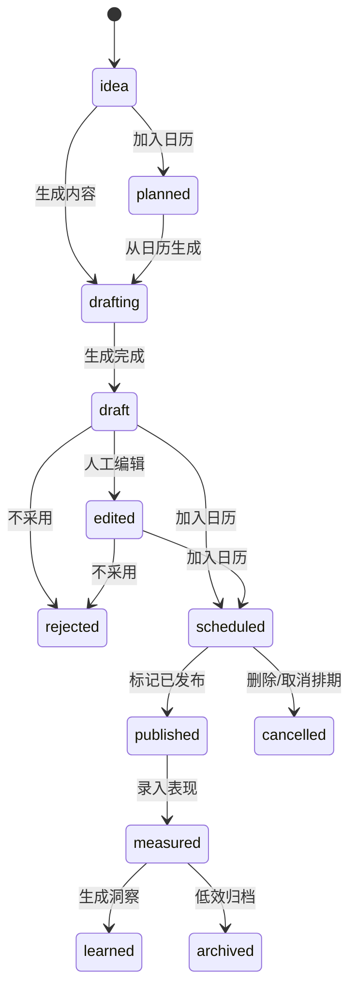

# Design: content-lifecycle-v1 内容生命周期闭环

> 本文档回答 V1.1 "内容生命周期闭环"如何落地。  
> Schema 以 `db/migrations/drafts/007_content_lifecycle.sql` 为唯一来源；本文只引用，不擅自改名。

---

## 1. 设计原则

| 原则 | 约束 |
|---|---|
| API 契约先行 | B/F 并行前先固定 HTTP API、JSON Schema、错误码和 idempotency 行为；实现不得临时改字段名 |
| 状态机显式化 | Topic、CalendarItem、ContentDraft 都用显式 `status`，不靠数组删除或隐式字段判断 |
| 软删除优先 | CalendarItem 删除默认写 `status='cancelled'` + `deleted_at`，列表默认过滤 `deleted_at IS NULL` |
| OCC rev | `topics`、`content_strategies`、`calendar_items` 写入必须提交 `rev`，后端按 `WHERE ... AND rev = expected_rev` 更新 |
| Pydantic 状态校验 | DB 使用 TEXT + CHECK；`generated_content.status` 没有 DB CHECK，必须由 Pydantic 校验 `draft/edited/scheduled/published/rejected` |
| tenant 注入 | `tenant_id` 只从 `verify_token` 的 `AuthContext` 注入，前端不得传 body/query 覆盖 |
| RLS + app WHERE 双保险 | storage SQL 继续显式 `WHERE tenant_id = %s`，PG RLS 作为兜底隔离 |

---

## 2. 数据对象 Schema

以下 SQL 逐字引用自 `db/migrations/drafts/007_content_lifecycle.sql` 的四个对象区块。实现时应从 drafts 平移到 `db/migrations/007_content_lifecycle.sql`，不得改字段名、类型、CHECK 或默认值。

### 2.1 `topics`

```sql
CREATE TABLE topics (
    topic_id        TEXT PRIMARY KEY,
    tenant_id       UUID NOT NULL REFERENCES tenants(tenant_id) ON DELETE CASCADE,
    goal_id         TEXT REFERENCES goals(goal_id) ON DELETE SET NULL,
    persona_id      TEXT REFERENCES personas(persona_id) ON DELETE SET NULL,
    title           TEXT NOT NULL,
    angle           TEXT,
    funnel_stage    TEXT CHECK (funnel_stage IN ('traffic', 'trust', 'conversion')),
    source          TEXT NOT NULL DEFAULT 'manual'
                    CHECK (source IN ('ai', 'manual', 'market_insight', 'memory')),
    source_refs     JSONB NOT NULL DEFAULT '[]'::jsonb,    -- 关联笔记/memory/知识库 id 列表
    status          TEXT NOT NULL DEFAULT 'idea'
                    CHECK (status IN ('idea', 'planned', 'drafting', 'drafted',
                                       'scheduled', 'published', 'archived')),
    created_by      TEXT NOT NULL DEFAULT 'user'
                    CHECK (created_by IN ('user', 'orchestrator', 'intel',
                                           'analyst', 'content', 'scheduler', 'system')),
    rev             INTEGER NOT NULL DEFAULT 1,
    created_at      TIMESTAMPTZ NOT NULL DEFAULT now(),
    updated_at      TIMESTAMPTZ NOT NULL DEFAULT now()
);

ALTER TABLE topics ENABLE ROW LEVEL SECURITY;
ALTER TABLE topics FORCE ROW LEVEL SECURITY;
CREATE POLICY tenant_isolation_topics ON topics
    USING (tenant_id = current_setting('app.tenant_id', true)::uuid)
    WITH CHECK (tenant_id = current_setting('app.tenant_id', true)::uuid);

CREATE INDEX idx_topics_tenant_goal ON topics (tenant_id, goal_id);
CREATE INDEX idx_topics_tenant_status ON topics (tenant_id, status, updated_at DESC);
CREATE INDEX idx_topics_tenant_persona ON topics (tenant_id, persona_id);
```

### 2.2 `content_strategies`

```sql
CREATE TABLE content_strategies (
    strategy_id        TEXT PRIMARY KEY,
    tenant_id          UUID NOT NULL REFERENCES tenants(tenant_id) ON DELETE CASCADE,
    topic_id           TEXT REFERENCES topics(topic_id) ON DELETE SET NULL,
    manual_input_hint  TEXT,                        -- 当 topic_id 为 NULL 时必须有
    target_reader      TEXT,
    funnel_stage       TEXT CHECK (funnel_stage IN ('traffic', 'trust', 'conversion')),
    angle              TEXT,
    hook               TEXT,
    key_points         JSONB NOT NULL DEFAULT '[]'::jsonb,
    cta                TEXT,
    avoid_points       JSONB NOT NULL DEFAULT '[]'::jsonb,
    evidence_refs      JSONB NOT NULL DEFAULT '[]'::jsonb,
    memory_refs        JSONB NOT NULL DEFAULT '[]'::jsonb,
    knowledge_refs     JSONB NOT NULL DEFAULT '[]'::jsonb,
    created_by         TEXT NOT NULL DEFAULT 'user'
                       CHECK (created_by IN ('user', 'orchestrator', 'intel',
                                              'analyst', 'content', 'scheduler', 'system')),
    rev                INTEGER NOT NULL DEFAULT 1,
    created_at         TIMESTAMPTZ NOT NULL DEFAULT now(),
    updated_at         TIMESTAMPTZ NOT NULL DEFAULT now(),
    CHECK (topic_id IS NOT NULL OR manual_input_hint IS NOT NULL)
);

ALTER TABLE content_strategies ENABLE ROW LEVEL SECURITY;
ALTER TABLE content_strategies FORCE ROW LEVEL SECURITY;
CREATE POLICY tenant_isolation_strategies ON content_strategies
    USING (tenant_id = current_setting('app.tenant_id', true)::uuid)
    WITH CHECK (tenant_id = current_setting('app.tenant_id', true)::uuid);

CREATE INDEX idx_strategies_tenant_topic ON content_strategies (tenant_id, topic_id);
CREATE INDEX idx_strategies_tenant_created ON content_strategies (tenant_id, created_at DESC);
```

### 2.3 `calendar_items`

```sql
CREATE TABLE calendar_items (
    calendar_item_id  TEXT PRIMARY KEY,
    tenant_id         UUID NOT NULL REFERENCES tenants(tenant_id) ON DELETE CASCADE,
    topic_id          TEXT REFERENCES topics(topic_id) ON DELETE SET NULL,
    content_id        TEXT REFERENCES generated_content(content_id) ON DELETE SET NULL,
    scheduled_date    DATE NOT NULL,
    scheduled_time    TEXT,                          -- HH:MM 或自然语言(LLM 给出)
    funnel_stage      TEXT CHECK (funnel_stage IN ('traffic', 'trust', 'conversion')),
    status            TEXT NOT NULL DEFAULT 'planned'
                      CHECK (status IN ('planned', 'drafted', 'scheduled',
                                         'published', 'cancelled')),
    delete_mode       TEXT NOT NULL DEFAULT 'soft'
                      CHECK (delete_mode IN ('soft', 'hard')),
    deleted_at        TIMESTAMPTZ,                   -- NULL = 未删除,值 = 软删除时间戳
    created_by        TEXT NOT NULL DEFAULT 'user'
                      CHECK (created_by IN ('user', 'orchestrator', 'intel',
                                             'analyst', 'content', 'scheduler', 'system')),
    rev               INTEGER NOT NULL DEFAULT 1,
    created_at        TIMESTAMPTZ NOT NULL DEFAULT now(),
    updated_at        TIMESTAMPTZ NOT NULL DEFAULT now()
);

ALTER TABLE calendar_items ENABLE ROW LEVEL SECURITY;
ALTER TABLE calendar_items FORCE ROW LEVEL SECURITY;
CREATE POLICY tenant_isolation_calendar ON calendar_items
    USING (tenant_id = current_setting('app.tenant_id', true)::uuid)
    WITH CHECK (tenant_id = current_setting('app.tenant_id', true)::uuid);

CREATE INDEX idx_calendar_tenant_date ON calendar_items (tenant_id, scheduled_date)
    WHERE deleted_at IS NULL;
CREATE INDEX idx_calendar_tenant_status ON calendar_items (tenant_id, status)
    WHERE deleted_at IS NULL;
CREATE INDEX idx_calendar_tenant_topic ON calendar_items (tenant_id, topic_id);
CREATE INDEX idx_calendar_tenant_content ON calendar_items (tenant_id, content_id);
```

### 2.4 `generated_content` 扩列

```sql
ALTER TABLE generated_content
    ADD COLUMN IF NOT EXISTS topic_id          TEXT REFERENCES topics(topic_id) ON DELETE SET NULL,
    ADD COLUMN IF NOT EXISTS strategy_id       TEXT REFERENCES content_strategies(strategy_id) ON DELETE SET NULL,
    ADD COLUMN IF NOT EXISTS calendar_item_id  TEXT REFERENCES calendar_items(calendar_item_id) ON DELETE SET NULL,
    ADD COLUMN IF NOT EXISTS knowledge_refs    JSONB NOT NULL DEFAULT '[]'::jsonb,
    ADD COLUMN IF NOT EXISTS memory_refs       JSONB NOT NULL DEFAULT '[]'::jsonb,
    ADD COLUMN IF NOT EXISTS rev               INTEGER NOT NULL DEFAULT 1;

-- 注:status 列原 DEFAULT 'draft',无 CHECK 约束,PRD §8.3 扩展集合(draft / edited /
-- scheduled / published / rejected)无需 DDL 改动;由 Pydantic 层做 in-set 校验。
-- rev 列对齐 topics / content_strategies / calendar_items 的 OCC 风格,
-- 草稿编辑用 WHERE content_id = %s AND rev = %s,版本不匹配返回 409。

CREATE INDEX IF NOT EXISTS idx_content_tenant_topic ON generated_content (tenant_id, topic_id);
CREATE INDEX IF NOT EXISTS idx_content_tenant_calendar ON generated_content (tenant_id, calendar_item_id);
CREATE INDEX IF NOT EXISTS idx_content_tenant_strategy ON generated_content (tenant_id, strategy_id);
```

---

## 3. HTTP API 契约

### 3.1 通用约束

- `Authorization: Bearer <jwt>` 必填，`tenant_id` 从 `AuthContext.tenant_id` 注入。
- 请求体和 query 中出现 `tenant_id` 时，后端 MUST 返回 422。
- 写入端点 `POST` / `PUT` / `DELETE` MUST 要求 `Idempotency-Key` header；缺失返回 428。
- 有 `rev` 列的对象写入必须带 `rev`，版本不匹配返回 409。
- GET 默认不返回软删除的 calendar item，除非 `include_deleted=true`。
- JSONB refs 统一使用数组：`[{ "type": "note|memory|knowledge|strategy", "id": "...", "label": "..." }]`。

### 3.2 公共 JSON Schema

```json
{
  "Ref": {"type": "object", "required": ["type", "id"], "properties": {"type": {"type": "string"}, "id": {"type": "string"}, "label": {"type": "string"}}},
  "Topic": {"type": "object", "required": ["topic_id", "title", "source", "status", "rev"], "properties": {"topic_id": {"type": "string"}, "goal_id": {"type": ["string", "null"]}, "persona_id": {"type": ["string", "null"]}, "title": {"type": "string"}, "angle": {"type": ["string", "null"]}, "funnel_stage": {"enum": ["traffic", "trust", "conversion", null]}, "source": {"enum": ["ai", "manual", "market_insight", "memory"]}, "source_refs": {"type": "array", "items": {"$ref": "#/Ref"}}, "status": {"enum": ["idea", "planned", "drafting", "drafted", "scheduled", "published", "archived"]}, "created_by": {"enum": ["user", "orchestrator", "intel", "analyst", "content", "scheduler", "system"]}, "rev": {"type": "integer"}, "created_at": {"type": "string"}, "updated_at": {"type": "string"}}},
  "ContentStrategy": {"type": "object", "required": ["strategy_id", "rev"], "properties": {"strategy_id": {"type": "string"}, "topic_id": {"type": ["string", "null"]}, "manual_input_hint": {"type": ["string", "null"]}, "target_reader": {"type": ["string", "null"]}, "funnel_stage": {"enum": ["traffic", "trust", "conversion", null]}, "angle": {"type": ["string", "null"]}, "hook": {"type": ["string", "null"]}, "key_points": {"type": "array"}, "cta": {"type": ["string", "null"]}, "avoid_points": {"type": "array"}, "evidence_refs": {"type": "array"}, "memory_refs": {"type": "array"}, "knowledge_refs": {"type": "array"}, "created_by": {"type": "string"}, "rev": {"type": "integer"}, "created_at": {"type": "string"}, "updated_at": {"type": "string"}}},
  "CalendarItem": {"type": "object", "required": ["calendar_item_id", "scheduled_date", "status", "delete_mode", "rev"], "properties": {"calendar_item_id": {"type": "string"}, "topic_id": {"type": ["string", "null"]}, "content_id": {"type": ["string", "null"]}, "scheduled_date": {"type": "string", "format": "date"}, "scheduled_time": {"type": ["string", "null"]}, "funnel_stage": {"enum": ["traffic", "trust", "conversion", null]}, "status": {"enum": ["planned", "drafted", "scheduled", "published", "cancelled"]}, "delete_mode": {"enum": ["soft", "hard"]}, "deleted_at": {"type": ["string", "null"]}, "created_by": {"type": "string"}, "rev": {"type": "integer"}, "created_at": {"type": "string"}, "updated_at": {"type": "string"}}},
  "ContentDraft": {"type": "object", "required": ["content_id", "status"], "properties": {"content_id": {"type": "string"}, "goal_id": {"type": ["string", "null"]}, "persona_id": {"type": ["string", "null"]}, "topic_id": {"type": ["string", "null"]}, "strategy_id": {"type": ["string", "null"]}, "calendar_item_id": {"type": ["string", "null"]}, "title": {"type": ["string", "null"]}, "body": {"type": ["string", "null"]}, "hashtags": {"type": "array", "items": {"type": "string"}}, "publish_at": {"type": ["string", "null"]}, "status": {"enum": ["draft", "edited", "scheduled", "published", "rejected"]}, "knowledge_refs": {"type": "array"}, "memory_refs": {"type": "array"}, "meta": {"type": ["object", "null"]}, "created_at": {"type": "string"}, "updated_at": {"type": "string"}}}
}
```

### 3.3 Endpoint 列表

| Endpoint | Request JSON Schema | Response JSON Schema | 说明 |
|---|---|---|---|
| `GET /api/v1/topics?goal_id=&status=` | query: `goal_id?: string`, `status?: Topic.status` | `{ "items": Topic[], "total": integer }` | 租户内选题列表 |
| `POST /api/v1/topics` | `TopicCreate = title + optional goal_id/persona_id/angle/funnel_stage/source/source_refs` | `Topic` | 默认 `source='manual'`、`status='idea'` |
| `PUT /api/v1/topics/{topic_id}` | `TopicUpdate = partial Topic + required rev` | `Topic` | OCC 失败 409 |
| `DELETE /api/v1/topics/{topic_id}` | header `Idempotency-Key`, query `rev` | `{ "topic_id": string, "status": "archived" }` | 归档，不物理删除 |
| `POST /api/v1/topics/{topic_id}/generate-content` | `{ "strategy_id": "string|null", "count": 1, "persist": true }` | `{ "items": ContentDraft[], "total": integer, "strategy": ContentStrategy|null }` | 成功后 topic 可转 `drafting/drafted` |
| `GET /api/v1/calendar?from=&to=&status=&include_deleted=false` | query filters | `{ "items": CalendarItem[], "total": integer }` | 默认过滤软删除 |
| `POST /api/v1/calendar` | `{ "topic_id": "string|null", "content_id": "string|null", "scheduled_date": "YYYY-MM-DD", "scheduled_time": "string|null", "funnel_stage": "traffic|trust|conversion|null" }` | `CalendarItem` | 创建计划项 |
| `PUT /api/v1/calendar/{calendar_item_id}` | `CalendarItemUpdate = partial CalendarItem + required rev` | `CalendarItem` | 校验状态跃迁 |
| `DELETE /api/v1/calendar/{calendar_item_id}` | header `Idempotency-Key`, query `rev`, `mode=soft|hard` | `CalendarItem` or `{ "deleted": true }` | 默认软删除 |
| `POST /api/v1/calendar/{calendar_item_id}/generate-content` | `{ "strategy_id": "string|null", "count": 1, "persist": true }` | `{ "items": ContentDraft[], "calendar_item": CalendarItem }` | 生成后 calendar status=`drafted` |
| `GET /api/v1/strategies?topic_id=` | query `topic_id?: string` | `{ "items": ContentStrategy[], "total": integer }` | 策略列表 |
| `GET /api/v1/strategies/{strategy_id}` | path only | `ContentStrategy` | 租户内详情 |
| `POST /api/v1/strategies` | `StrategyCreate = topic_id or manual_input_hint + target_reader/funnel_stage/angle/hook/key_points/cta/avoid_points/evidence_refs/memory_refs/knowledge_refs` | `ContentStrategy` | DB CHECK 同步在 Pydantic 校验 |
| `PUT /api/v1/strategies/{strategy_id}` | `StrategyUpdate = partial ContentStrategy + required rev` | `ContentStrategy` | OCC 失败 409 |
| `DELETE /api/v1/strategies/{strategy_id}` | header `Idempotency-Key` | `{ "deleted": true, "strategy_id": string }` | 物理删除策略（不软删，策略可重建） |
| `GET /api/v1/drafts?goal_id=&persona_id=&status=&topic_id=&date_from=&date_to=` | query filters | `{ "items": ContentDraft[], "total": integer }` | 草稿箱 |
| `GET /api/v1/drafts/{content_id}` | path only | `ContentDraft` | 租户内详情 |
| `PUT /api/v1/drafts/{content_id}` | partial `ContentDraft` without tenant_id | `ContentDraft` | 状态仅允许 draft/edited/scheduled/published/rejected |
| `POST /api/v1/drafts/{content_id}/duplicate` | `{ "title_suffix": "string|null" }` | `ContentDraft` | 新 `content_id` |
| `POST /api/v1/drafts/{content_id}/schedule` | `{ "scheduled_date": "YYYY-MM-DD", "scheduled_time": "string|null", "funnel_stage": "traffic|trust|conversion|null" }` | `{ "draft": ContentDraft, "calendar_item": CalendarItem }` | draft status=`scheduled` |
| `POST /api/v1/drafts/{content_id}/reject` | `{ "reason": "string|null" }` | `ContentDraft` | draft status=`rejected` |
| `POST /api/v1/content/generate` | existing request + optional `topic_id/strategy_id/calendar_item_id/knowledge_refs/memory_refs` | `{ "items": ContentDraft[], "total": integer, "error": "string|null" }` | 兼容旧 body，新增 refs |
| `GET /api/v1/content?topic_id=&strategy_id=&calendar_item_id=&status=` | query filters | `{ "items": ContentDraft[], "total": integer }` | content 列表兼容入口 |

### 3.4 错误码

| Code | 场景 |
|---:|---|
| 400 | 非法状态跃迁，例如 `published -> draft` |
| 401 | JWT 缺失、过期或无效 |
| 404 | 当前 tenant 下对象不存在 |
| 409 | `rev` 不匹配、重复 idempotency payload 冲突 |
| 422 | Pydantic 校验失败、body/query 传入 `tenant_id`、策略缺少 `topic_id` 且缺少 `manual_input_hint` |
| 428 | 写入端点缺少 `Idempotency-Key` |
| 500 | LLM 或存储异常，响应必须包含可读 `detail`，不得泄漏 token/cookie |

### 3.5 错误响应 body schema

所有非 2xx 响应统一格式，使 F 流和未来客户端能一致解析：

```json
{
  "error": {
    "code": "string",                  // 机器可读错误码,如 "rev_mismatch" / "missing_idempotency_key" / "invalid_status_transition"
    "message": "string",                // 人类可读简短描述
    "detail": "string | null",          // 可选,提供额外上下文(不含敏感数据)
    "field": "string | null",           // 422 时指向出错字段
    "current_rev": "integer | null",    // 409 OCC 冲突时返回当前最新 rev,客户端可据此重取
    "request_id": "string"              // 服务端生成,便于排查
  }
}
```

**错误码常量**（实现时落到 `server/errors.py` 枚举）：

| code | HTTP | 场景 |
|---|---:|---|
| `invalid_status_transition` | 400 | 状态跃迁不允许 |
| `auth_required` | 401 | JWT 缺失 |
| `auth_invalid` | 401 | JWT 无效或过期 |
| `not_found` | 404 | 对象不存在或不属于当前 tenant |
| `rev_mismatch` | 409 | OCC rev 不匹配 |
| `idempotency_conflict` | 409 | 相同 Idempotency-Key 不同 payload |
| `validation_error` | 422 | Pydantic 校验失败 |
| `tenant_in_body_forbidden` | 422 | 客户端尝试传入 `tenant_id` |
| `strategy_missing_anchor` | 422 | 策略既无 `topic_id` 也无 `manual_input_hint` |
| `missing_idempotency_key` | 428 | 写入端点缺 Idempotency-Key header |
| `llm_provider_error` | 500 | LLM 调用失败 |
| `storage_error` | 500 | PG / 存储层异常 |

**安全约束**：
- `detail` 字段绝不包含 JWT / Cookie / API key / vendor token 等敏感数据
- `detail` 字段超过 500 字符必须截断
- 500 错误的 `detail` 在生产环境只返回"内部错误，request_id 详查日志"，详细错误进 `audit_log`

### 3.6 列表分页参数

所有 `GET` 列表端点（`/topics` / `/calendar` / `/strategies` / `/drafts` / `/content`）统一支持：

| 参数 | 类型 | 默认 | 范围 | 说明 |
|---|---|---:|---|---|
| `page` | integer | `1` | ≥ 1 | 页码，从 1 起 |
| `page_size` | integer | `20` | 1-100 | 每页条数，超 100 截断为 100 |
| `sort` | string | 各端点不同 | 见下 | 排序字段，前缀 `-` 为降序 |

**默认 sort 字段**（按端点）：

| 端点 | 默认 sort | 备选 |
|---|---|---|
| `/topics` | `-updated_at` | `title` / `-created_at` / `status` |
| `/calendar` | `scheduled_date` | `-scheduled_date` / `-updated_at` / `status` |
| `/strategies` | `-created_at` | `topic_id` |
| `/drafts` | `-updated_at` | `-created_at` / `status` |
| `/content` | `-created_at` | `-updated_at` / `status` |

**响应 envelope**（列表统一）：

```json
{
  "items": [...],
  "total": 123,                          // 满足 query 条件的总条数（含未返回的 page）
  "page": 1,
  "page_size": 20,
  "has_more": true                       // page * page_size < total
}
```

**性能约束**：
- `total` 在 `count > 10000` 时返回 `null`，避免 PG count 扫表（客户端用 `has_more` 翻页）
- 所有 list 端点必须用 `tenant_id` 第一列的索引（migration 007 已建）

### 3.7 生成内容端点同步约定

`POST /api/v1/content/generate`、`/topics/{id}/generate-content`、`/calendar/{id}/generate-content` 三个生成端点统一约定：

**调用模型**：**同步阻塞**（与现有 `/content/generate` 行为一致，不引入异步 polling）

**超时**：
- 服务端 LLM 调用硬超时 90s（`agent_tools/llm_provider.py` 已有 timeout）
- 路由层端到端硬超时 120s（含 PG 写入 + audit_log）
- 超时返回 `504 Gateway Timeout`，错误码 `llm_provider_timeout`
- 客户端建议 fetch timeout 设 150s

**部分成功语义**：
- 请求 `count=3`，实际生成 2 篇成功 1 篇失败 → 整体 200 OK
- 响应 `items` 含成功的 2 篇 + `partial_failures` 数组（每条含失败原因）
- 不允许"部分成功隐式 silent fail"

**Idempotency-Key 与生成端点**：
- 相同 Idempotency-Key 重复调用返回**第一次**的结果（不重复消耗 LLM token）
- cache TTL 24 小时（`agent_tools/idempotency.py` 默认值）
- 不同 payload 同 key 返 409 `idempotency_conflict`

**Cost 上报**：
- 每次成功生成调用必须在 audit_log 记录 `llm_provider / tokens_used / cost_usd`
- F 流可选展示 cost 信息（V1.1 不强制 UI 展示）

**未来异步化预留 hook**：
- V1.x 不实现，但 response 结构预留 `task_id` 字段（V1.1 始终为 `null`）
- 未来若要改异步 polling，client 接口不需改，仅切 task_id 非空 + 加 `/api/v1/tasks/{task_id}` 端点

### 3.8 Idempotency-Key 缓存策略（中间件层）

`server/middleware/idempotency.py` 应用所有写入端点（POST / PUT / DELETE），策略：

**只缓存 2xx 响应**：
- 2xx：写入 cache（TTL 24h），同 key 重放命中
- 4xx / 5xx：**不缓存**

**Rationale**：
- 422 校验失败时，客户端常见做法是 fix payload 后立即重提；若缓存 4xx，用户必须换新 Idempotency-Key，UX 反而差
- 5xx 多为瞬时故障（DB 闪断、LLM 超时），重试时希望真重跑而非读到错误结果
- 业务幂等的本质是"成功操作不重复"，失败操作没有"已发生"的语义，重试是正确行为

**冲突检测仍生效**：
- 同 key + 不同 payload → 409 `idempotency_conflict`（无论原响应 2xx 还是 4xx）
- 同 key + 同 payload + 原响应 4xx → 中间件透传到 handler 真重跑（不是 cache hit）

**客户端契约**：
- 写入端点必须带 `Idempotency-Key`（缺失 → 400 `missing_idempotency_key`）
- key 由前端生成（`crypto.randomUUID()` + SSR fallback，见 `frontend/lib/api.ts::generateIdempotencyKey`）
- 同一次"用户意图"复用同 key；用户主动重试（fix payload）应换 key

---

## 4. 状态机图

PRD §8.1 的 `in_calendar` 在物理 schema 中映射为 `topics.status='planned'` + `calendar_items.status='planned'`。



物理状态映射：

| 产品状态 | 表/字段 |
|---|---|
| `idea/planned/drafting/drafted/scheduled/published/archived` | `topics.status` |
| `planned/drafted/scheduled/published/cancelled` | `calendar_items.status` |
| `draft/edited/scheduled/published/rejected` | `generated_content.status`，Pydantic 校验 |

---

## 5. 遗留数据迁移路径

`scripts/migrate_goals_json_to_pg.py` 处理流程：

```python
def main(tenant_id: str, dry_run: bool, verify: bool):
    src = Path("config/goals.json")
    bak = Path("config/goals.json.bak")
    if not dry_run:
        copy_file(src, bak, overwrite=False)

    data = load_json(src)
    rows = {"topics": [], "calendar_items": []}
    title_to_topic_id = {}

    for goal in data.get("goals", []):
        goal_id = goal.get("goal_id") or goal.get("id")
        persona_id = goal.get("persona_id")

        for idx, item in enumerate(goal.get("topic_library", [])):
            topic_id = stable_id("topic", tenant_id, goal_id, item.get("title"), idx)
            rows["topics"].append({
                "topic_id": topic_id,
                "tenant_id": tenant_id,
                "goal_id": goal_id,
                "persona_id": persona_id,
                "title": item["title"],
                "angle": item.get("angle"),
                "funnel_stage": item.get("funnel_stage"),
                "source": "manual",
                "source_refs": [{"type": "legacy_goal", "id": goal_id}],
                "status": "idea",
                "created_by": "system"
            })
            title_to_topic_id[normalize(item["title"])] = topic_id

        for idx, item in enumerate(goal.get("content_calendar", [])):
            title = item.get("title") or item.get("topic")
            topic_id = title_to_topic_id.get(normalize(title))
            calendar_item_id = stable_id("calendar", tenant_id, goal_id, title, idx)
            rows["calendar_items"].append({
                "calendar_item_id": calendar_item_id,
                "tenant_id": tenant_id,
                "topic_id": topic_id,
                "scheduled_date": parse_date(item.get("date")),
                "scheduled_time": item.get("time"),
                "funnel_stage": item.get("funnel_stage") or item.get("type"),
                "status": normalize_calendar_status(item.get("status", "planned")),
                "delete_mode": "soft",
                "created_by": "system"
            })

    if dry_run:
        print_counts(rows)
        return

    upsert_topics(rows["topics"])
    upsert_calendar_items(rows["calendar_items"])

    # legacy 兼容：字段保留，数组置空，避免旧读路径崩溃
    for goal in data.get("goals", []):
        goal["topic_library"] = []
        goal["content_calendar"] = []
    write_json(src, data)

    if verify:
        compare_counts_and_samples(rows, tenant_id)
```

迁移要求：

- 幂等：`topic_id` / `calendar_item_id` 使用稳定派生，不用随机 uuid。
- 失败不删源：迁移前生成 `.bak`，任何 mismatch 退出码 1。
- 迁移后 PG 是新对象源真相，legacy JSON 只保留兼容字段。

---

## 6. 验收用例映射

| PRD §12 用例 | 页面 | API |
|---|---|---|
| 用例 1 日历基础管理 | 日历入口页或 `topics/page.tsx` 日历区 | `GET/PUT/DELETE /api/v1/calendar/{calendar_item_id}` |
| 用例 2 选题进入内容创作 | `topics/page.tsx` -> `content/page.tsx?topicId=` | `GET /api/v1/topics/{id}`、`POST /api/v1/topics/{id}/generate-content`、`POST /api/v1/strategies` |
| 用例 3 日历项继续生成内容 | 日历项操作 -> 内容页/草稿箱 | `POST /api/v1/calendar/{id}/generate-content`、`PUT /api/v1/calendar/{id}` |
| 用例 4 生成内容暂存 | `content/page.tsx`、`drafts/page.tsx` | `POST /api/v1/content/generate`、`GET/PUT /api/v1/drafts/*`、`POST /api/v1/drafts/{id}/schedule` |
| 用例 5 知识库引用 | `content/page.tsx` 草稿详情引用区 | `POST /api/v1/strategies` 保存 `knowledge_refs`，`POST /api/v1/content/generate` 和 `GET /api/v1/drafts/{id}` 回显 `knowledge_refs` |

用例 5 的知识库 CRUD 不在本 change 内；本 change 只保证策略和草稿可记录并展示 `knowledge_refs`，完整连接器由 `knowledge-connector-mvp` 承接。

---

## 7. 风险与回滚

| 风险 | 处理 |
|---|---|
| migration 执行失败 | 保持 `db/migrations/drafts/007_content_lifecycle.sql` 不动；正式 migration 单事务执行，失败自动回滚 |
| 迁移脚本写入部分数据后 verify 失败 | 使用稳定 id 重跑覆盖；如仍失败，恢复 `config/goals.json.bak`，不切前端入口 |
| legacy JSON 被置空后需要回退 | 把 `config/goals.json.bak` 改回 `config/goals.json`，重启服务 |
| 新 API 上线后状态混乱 | 关闭 Next.js 新入口，保留旧 content/topics 页面；PG 表数据可保留为未使用状态 |
| 重复生成造成脏数据 | 依赖 `Idempotency-Key`；同 key 同 payload 返回同结果，不同 payload 返回 409 |
| 多租户误写 | 所有 storage 方法必须显式 `tenant_id`，测试覆盖跨 tenant 不可见 |

---

## Schema 反馈

1. ✅ **Resolved (2026-05-26)** — `generated_content.rev INTEGER NOT NULL DEFAULT 1` 已直接加入 `drafts/007_content_lifecycle.sql` 的 `ALTER TABLE` 段，不另起 migration。草稿编辑统一走列级 OCC：`WHERE content_id = %s AND rev = %s`，版本不匹配返回 409。
2. ℹ️ **Accepted by design** — `topics` 不加 `deleted_at`，选题删除映射为 `status='archived'`。这是草案的有意设计，与 PRD §8.1 的状态机一致。
3. ℹ️ **Implementation note** — `generated_content.status` 无 DB CHECK 是有意保留（避免 ALTER ENUM 锁表）；Pydantic 层 MUST 严格枚举 `draft/edited/scheduled/published/rejected`。实施时还需一次性数据迁移把历史 `approved` 值映射为 `published`（旧 schema 默认值，见 `001_init_schema.sql:69` 注释）。
